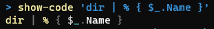
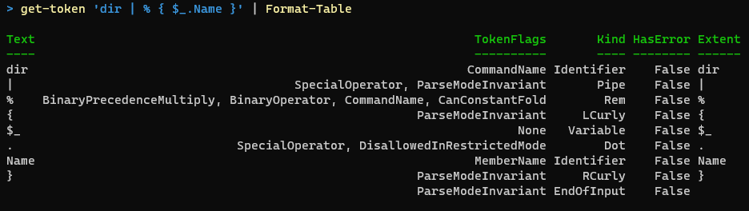
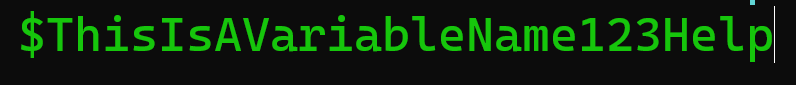
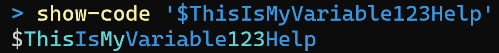

# Highlight

Here we have a PowerShell module for syntax highlighting PowerShell code, using PowerShell itself.

## Show-Code

## Usage

Install the module from PowerShellGallery:

	Install-Module -Name NimbleHighlight

Then Import the module to make it available in your session:

	Import-Module NimbleHighlight

Use it like so:

	Show-Code 'dir | % { $_.Name }'

Will display the code, `dir | % { $_.Name }`, with syntax highlighting.



The `Show-Code` function itself is very simple, and its only significant line of code is this:

	Get-Token $code | Show-Token;

i.e., it tokenizes the code that is passed to it, and asks the `Show-Token` Cmdlet to write the tokens with syntax highlighting.

## Get-Token

`Get-Token` is also very simple -- it only has one significant line of code:

	$result = [System.Management.Automation.Language.Parser]::ParseInput($code, [ref]$ParserTokens, [ref]$null) | Out-Null;

All of its work is done by the `ParseInput` method in `Automation.Language.Parser`. This is a nifty tokenizer, built right into PowerShell.

You could use `Get-Token` by itself to inspect the tokens returned from parsing any arbitrary piece of PowerShell -- e.g.

	Get-Token 'dir | % { $_.Name }' | Format-Table

| Text | TokenFlags | Kind | HasError | Extent |
|------|------------|------|----------|--------|
| `dir` | `CommandName` | `Identifier` | `False` | `dir` |
| `\|` | `SpecialOperator, ParseModeInvariant` | `Pipe` | `False` | `\|` |
| `%` | `BinaryPrecedenceMultiply, BinaryOperator, CommandName, CanConstantFold` | `Rem` | `False` | `%` |
| `{` | `ParseModeInvariant` | `LCurly` | `False` | `{` |
| `$_` | `None` | `Variable` | `False` | `$_` |
| `.` | `SpecialOperator, DisallowedInRestrictedMode` | `Dot` | `False` | `.` |
| `Name` | `MemberName` | `Identifier` | `False` | `Name` |
| `}` | `ParseModeInvariant` | `RCurly` | `False` | `}` |
|     | `ParseModeInvariant` | `EndOfInput` | `False` | |

Screenshot:



## Show-Token

Most of the work that `Show-Token` does involves special cases for "nested tokens". Once it knows the exact token or nested-token to be shown, it passes the result to a function `Write-Scrap` that then has to decide on the actual colors.

The following comment from `Show-Token` explains the tricky business of nested tokens. If we ignored the concept of Nested tokens, then a string such as `"Hello $world"` would be written in a single color -- the `$world` would be treated as a regular piece of text, not as an embedded expression. Here is the comment to describe nested tokens:


	# NESTED TOKENS ARE FUN
    # Strings (and here-strings) can contain nested tokens (as do nested expressions)
    #
    # write-host "This is my name $myName and yours is $yourName I believe!"
    #            |-----------------outer token ----------------------------| <-- $token
    # write-host "This is my name $myName and yours is $yourName I believe!"
    #                             |--t1-|              |---t2--|             <-- $token.NestedTokens
    # write-host "This is my name $myName and yours is $yourName I believe!"
    #            |----between1----|     |---between2---|                     <-- between Nested tokens
    # write-host "This is my name $myName and yours is $yourName I believe!"
    #                                                           |---after--| <-- after Nested tokens
    #
    # Observations:
    # - there are as many 'betweens' as there are nested tokens.
    # - there is exactly 1 'after'.
    # - the quotes (which differ from string, to herestring etc.) are part of between1 and after.

## Write-Scrap

Ah -- now here is the controversial custom syntax highlighter itself.

Taking the lead from `VS Code`, and in contradistinction from other syntax highlighters, it does a little bit extra than writing a single token in a single color.

- Variable names that start with `$` -- the `$` is in a different color to the variable name.
- Comments that start with `#` -- the `#` is a different shade of green than the comment itself.
- Quoted strings, the quote marks themselves are in a different color than the string.
- Here-Strings -- the "@" at the start and end of the string is in a different color to the string.

But the **most controversial aspect of all** -- in `camelCase` and `PascalCase` variables names, each "word" is written in a slightly different color. In particular the colors alternate between cyan and darkcyan. The purpose here is to aid readability.

Here is how the terminal itself would syntax highlight a long pascal cased name:



Versus how this highlighter would do the same:



## Bonus -- PascalCase Word Splitter: Split-Pascalwise

To facilitate the coloring of words in `camelCase` and `PascalCase` variable names, there is a handy Cmdlet included:

- `Split-Pascalwise`

Given a string that contains a mix of UPPER and lower case letters, it will split it into an array of word-like strings.

```powershell
> Split-Pascalwise 'ThisIsMyVariable123Help'
This
Is
My
Variable
123
Help
```

If you can't find some fun uses for a function like that, yours was a wasted life.

And since you're very curious (and why wouldn't you be) -- I'll share the regular expression at the heart of this thing.

```powershell
return ($_.ToString() -creplace '(?<!^)([A-Z0-9:_][a-z]|(?<=[a-z])[A-Z0-9:_])', ' $&').Split($null);
```

Note that it is case-sensitive (`creplace`) and it treats *any* switch from lower-case letters to capital letters or to numbers or to ':' or to '_' as indicating a word boundary.

Some of the tricky cases that this treats as intended are:

```powershell
> Split-Pascalwise 'DVDExtras'
DVD
Extras
```

-- consecutive capitals are a single "word", until the last capital which is assumed to belong with the lower-case letters that follow it.

```powershell
> Split-Pascalwise 'AsEasyAs123'
As
Easy
As
123
```

...Numbers behave like capitals. A group of number together are one word.

But this also means, a following word that doesn't start with a capital, might 'steal' the last digit as its capital.

```powershell
> Split-Pascalwise '123guid'
12
3guid
```

# Remember to quote your code appropriately

When asking `Show-Code` to show some code, remembering you are passing it a string, and this may mean that you need to escape some parts of the string, to get the intended effect.

For example, look at the unexpected result we get here:

	> show-code "hello $world"
	hello 

Where did the `$world` go? It got "evaluated" before it was passed to the `show-code` function!

To show the expected code, in this situation, we have a number of options. For example:

	> show-code "hello `$world"
	hello $world

... we escaped the `$` sign by prefixing it with a backtick. Or we could use single-quotes, so the `$` won't be evaluated:

	> show-code 'hello $world'
	hello $world
