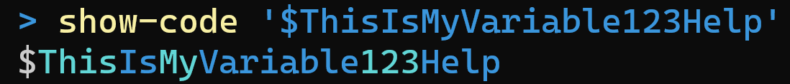

# Highlight

This is a group of powershell cmdLets that let you syntax highlight Powershell Code, from powershell code and scripts.

## Show-Code

Example:

	show-code "dir | % { $_.Name } "

Will display the code, `dir | % { $_.Name }`, with syntax highlighting.

The Show-Code function itself is very simple, and it's only significant line of code is this:

	Get-Token $code | Show-Token -debugMode:$debugMode;

i.e., it tokenizes the code that is passed to it, and asks the 'Show-Token' cmdLet to write the tokens with syntax highlighting.

## Get-Token

Get-token is also very simple -- it only has 1 significant line of code:

	$result = [System.Management.Automation.Language.Parser]::ParseInput($code, [ref]$ParserTokens, [ref]$null) | Out-Null;

That is, all of its work is done by the `ParseInput` method in `Automation.Language.Parser`.

## Show-Token

Most of the work that Show-Token does is to do with special cases for "nested tokens". Once it knows the exact token or nasted-token to be shown, it passes the result to a function `Write-Scrap` that then has to decide on the actual colors.

The following comment from Show-Token explains the tricky business of nested tokens. If we ignored the concept of Nested tokens, then a string such as `"Hello $world"` would be written in a single color -- the `$world` would be treated as a regular piece of text, not as an embedded expresion. Here is the comment to describe nested tokens:

	# NESTED TOKENS ARE FUN
    # Strings (and here-strings) can contain nested tokens (as do nested expressions)
    #
    # write-host "This is my name $myName and yours is $yourName I believe!"
    #            |-----------------outer token ----------------------------| <-- $token
    # write-host "This is my name $myName and yours is $yourName I believe!"
    #                             |--t1-|              |---t2--|             <-- $token.NestedTokens
    # write-host "This is my name $myName and yours is $yourName I believe!"
    #            |----between1----|     |---between2---|                     <-- between Nested tokens
    # write-host "This is my name $myName and yours is $yourName I believe!"
    #                                                           |---after--| <-- after Nested tokens
    #
    # Observations:
    # - there are as many 'betweens' as there are nested tokens.
    # - there is exactly 1 'after'.
    # - the quotes (which differ from string, to herestring etc.) are part of between1 and after.

## Write-Scrap

This is the controversial custom syntax highlighter itself.

Taking the lead from `VS Code`, and in contradistinction from other syntax highlighters, it does a little bit extra than writing a single token in a single color.

- Variable names that start with `$` -- the `$` is in a different color to the variable name.
- Comments that start with `#` -- the `#` is a different shade of green than the comment itself.
- Quoted strings, the quote marks themselves are in a different color than the string.

But the most controversial aspect of all -- in `camelCase` and `PascalCase` variables names, each "word" is written in a slightly different color. In particular the colors alternate between cyan and darkcyan. The purpose here is to aid readability.

Here is how the terminal itself would syntax highlight a long pascal cased name:

Versus how this highlighter would do the same:

## To use these functions...

"Dot" the Show-Code file.

	. .\Show-Code.ps1

It will, in turn, dot the `Get-Token.ps1` and `Show-Token.ps1` files that it depends upon. And `Show-Token` will dot the `Get-TokenColor.ps1` and `Show-Name.ps1` files that it depends upon.

So you can use "All of it" by dotting "Show-Code" -- or just dot the part you need, if you only want "Show-Token" or "Get-TokenColor" or "Show-Name".
